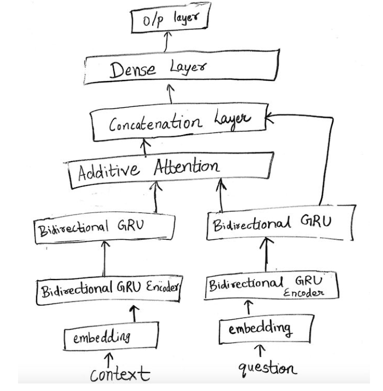

# Project 4. QA in Squad2.0
Apply NLP knowledge to implement a MRC system that will work on a real world challenge task: the Stanford Question Answering Dataset (SQuAD) v2. Only part of the full MRC task. In particular, input to the system is a passage with a couple of questions. For each question, the training data
contains either an Answer or a Plausible Answer. The latter is provided for questions that are not answerable given the accompanying text passage. The full MRC task requires providing the answer for answerable questions and identifying the remainder as unanswerable. For this assignment, we will only be attempting the second task: for each question, the output of your system should be a binary value indicating whether the question is answerable (a value of 1) or not answerable (a value of 0). No human intervention is allowed in deriving answers. Below is an example (from the training data):

5 models are implemented in this project.

In order to run all the models, you need to run Preprocess.ipynb first.

* Model 1:InferSent with Semantic Similarity. 
Description: We used pre-trained InferSent to get vector
representation and used cosine similarity metric (written by us) with threshold to predict label
* Model 2:InferSent with our own Syntactic Similarity score along with Semantic Similarity score and logistic regression. 
Description: We used pre-trained InferSent to get vector representation and used cosine similarity (written by
us) as a semantic similarity score. The preprocessed sentences and questions (as strings) are used to compute syntactic similarity score ( written by us) as discussed in experimentation.
* Model 3:Bidirectional LSTM Encoders with Neural Net.
Description: Instead of using pre-trained models to generate vector representation of sentences, we used Bidirectional LSTM Encoders and passed the vector representation into neural network for classification task.
* Model 4: Logistic Regression and Random Forest on feature based approach using similarity scores, POS and other metrics.
Description : We first turned the training data sentences and questions) into Glove Embeddings
with 300D and extract features below based on the sentence-question pairwise embeddings. Then we
trained a Logistic Regression model and Random Forest model using this features.
Final feature vector:
  ● TF-IDF features
  ● POS tag based similarity score
  ● BLEU-score
  ● Average word similarity (measure word
  overlap)
  ● Average wording embedding similarity
  ● average paragraph embedding
  ● TF-IDF weighted paragraph embedding
  ● average question embedding
  ● TF-IDF weighted question embedding

* Model 5:Using Bidirectional GRUs with Additive Attention
Description: In this approach, we used bidirectional GRUs as encoders to extract the vector representation of context and question and further added GRUs, additive attention and dense layers for the classification task. As we wanted to use mini-batch training , we also constrained the context to 600 words and question to 30 words by using padded sequences.

<b>Architecture of MODEL 5 </b>

## Result:

|Model |Accuracy |Precision |Recall |F1 score|
|:-------:|:-----------:|:-----------:|:-----------:|:-----------:|
|1 |0.523 |0.623| 0.5131| 0.5627 |
|2| 0.540 |0.567 |0.557| 0.565 |
|3| 0.552 |0.582| 0.548 |0.564 |
|4|0.612 |0.605 |0.614| 0.609|
|5|0.636 |0.667 |0.682 |0.652 |

<b>Quantitative Results and Analysis for all models </b>

* Baseline model zip file includes:
1.Model 1 is InferSent with Semantic Similarity. You can run MODEL2.ipynb for model 1.
2.Model 2 is InferSent with our own Syntactic Similarity score along with Semantic Similarity score and logistic regression. You can run MODEL2.ipynb for model 2.
3.Model 3 is Bidirectional LSTM Encoders with Neural Net. You can run MODEL3.ipynb for model 3.

* Final zip file includes:
4.Model 4 is Logistic Regression and Random Forest on feature based approach using similarity scores, POS and other metrics. You can run MODEL4.ipynb for model 4.
5.Model 5 is Using Bidirectional GRUs with Attention. You can run MODEL5.ipynb for model 5. rnnlayer.py is attention function we have referred from a github link: [link](https://github.com/wentaozhu/recurrent-attention-for-QA-SQUAD-based-on-keras).

Also, to slove the full task: identify the exact answer span of question, a attention model called BiDAF is typically used. The implementation of this model in Pytorch can refer to the gitub link: [link](https://github.com/kelayamatoz/BiDAF-PyTorch/)
