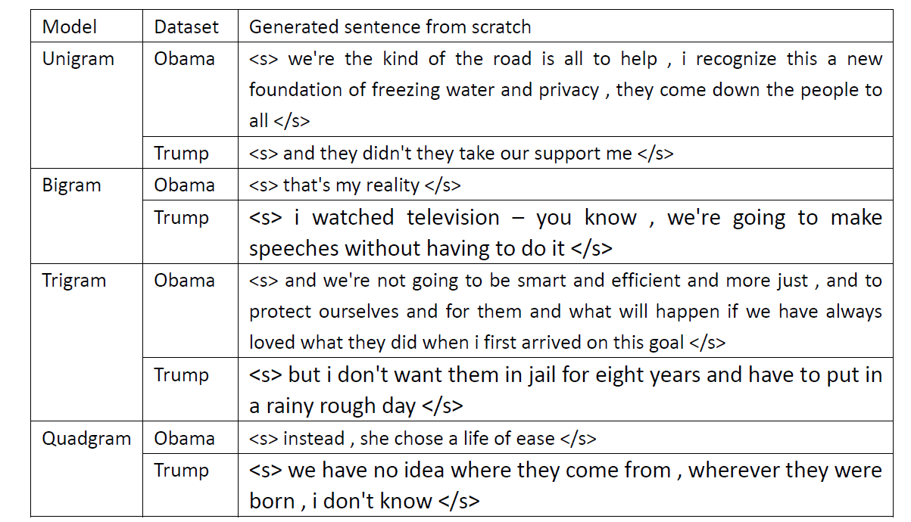

# Project1: Classification of Obama and Trump Speech data using Language models

In this projects, serval n-gram language models using both Obama and Trump datasets are tested.
n-gram models are smoothed using add-k smoothing. Classification Language models are evaluated with Perplexity.

## Random sentence generation with unsmoothed ngram
   Each generated sentence start with a "<S>" token and end with "</S>" token.
   
   For the evaluations, there are basically two tasks: 
   1. Seeded sentence generation where the several words in the start of sentences are predefined 
   2. Unseeded sentence generation where no words are given, sentences are generated from scratch. 
   Examples of unseeded generation for 4 ngram models are given below:
    

<b>Unseeded sentence generate on language models</b> 

   
   Note that The generated sentences for unigram model does not have coherence and some of the sentences are not even complete; the bigram model becomes better that it contains correct word combinations and is somewhat coherent. It is observed that bigram is current for generated sentences that are short in length. Trigram and guadgram generated sentences in most the cases are complete, coherent and understandable 

## Preprocessing
* To deal with unknow words: 
   1. Convert in the training set any word that is not in vocab set as unknown words and map a token of “UNK” 
   2. Do the same thing for the imported text corpus, replace the unknown word by “UNK” 
   3. Update the probability dictionary for the unigram model, adding an “UNK” key 
   4. Map the unknown word probability based on the count of “UNK” in the training file 

* To deal with unseen bigram: 
   1. Recollect the bigram tokens and update the dictionary for bigram, after mapping the ‘UNK’ key 
   2. The probability of unseen bigram is calculated by add-1 smoothing with the formula below: 
      Prob(unseen_biagram(a,b))=1/(count(a)+Vocab_size), count(a) is the number of count of bigrams that starts with token a, 
   
   Note for the step 2, we didn’t explicitly create a dictionary for every unseen bigram, because they are essentially same for all the unseen bigrams if they start with same word token, we calculate it on the fly and use it while we meet a specific unseen bigram during testing. The dictionary we created is only recording the probability of seen bigrams. 

## Result

To verify the method of calculating perplexity shown in the last section. We trained the language model and tested the speech classification accuracy over the dev set. The speech classification task is to classify a part of speech sequences as Obama’s speech or Trump’s speech. 
Add-1 smoothing 
The unigram model and bigram models are implemented with add-1 smoothing. The validation accuracy over the development set is shown in table 4. The dev set contains 100 sample of trumps speech and 100 samples of Obama speech. In this validation experiment, only the bigram models are considered. 

|Models 	|Obama dev set |	Trump dev set |	overall accuracy| 
|:--------------:|:-----------:|:-----------:|:-------------:|
|Unigram model |	0.965 |	0.92 |	0.935| 
Bigram model 	|0.98 	|0.95 |	0.965 |

  <b>Validation accuracy for unigram and bigram models</b> 

The validation accuracy in the dev set for different Ks is shown the table below 

|K 	|accuracy of Obama dev set| 	accuracy of Trump dev set| 	overall accuracy| 
|:--------------:|:-----------:|:-----------:|:-------------:|
|1 	|0.98| 	0.95| 	0.965| 
|2 	|0.97| 	0.93| 	0.94|
|3 	|0.93| 	0.92| 	0.925| 
|4 	|0.86| 	0.92| 	0.89| 
|5 	|0.73| 	0.91| 	0.82| 

  <b>Validation accuracy for different k in Laplacian smoothing over the dev set</b> 

As the k increases, the accuracy keeps decreasing. Thus, the best k is set as 1. For curiosity, 
we picked k as numbers smaller than 1 when calculating the probability and surprisingly get better result.

|K 	|accuracy of Obama dev set| 	accuracy of Trump dev set| 	overall accuracy| 
|:--------------:|:-----------:|:-----------:|:-------------:|
|0.1| 	1 |	0.95 |	0.975| 
|0.2 |	1 |	0.94 |	0.97| 
|0.5| 	0.99| 	0.94| 	0.965| 

  <b>Validation accuracy for decimal numbers of k in Laplacian smoothing over the dev set</b> 

Improved accuracies using decimal numbers of k (<1) suggests that the unseen bigram probability should be lower than the probability achieved by add-1 smoothing. A decimal number of K will result in higher probability of seen bigram and lower probability of unseen bigram. It reflects that some of the unseen bigram combination is highly unlikely and should not be smoothed to have 1 count same as others. Therefore, considering add-k smoothing, even if k=1 is best of choice yet is still limited in this regard. This finding also encouraged us to use a more advanced smoothing method.

