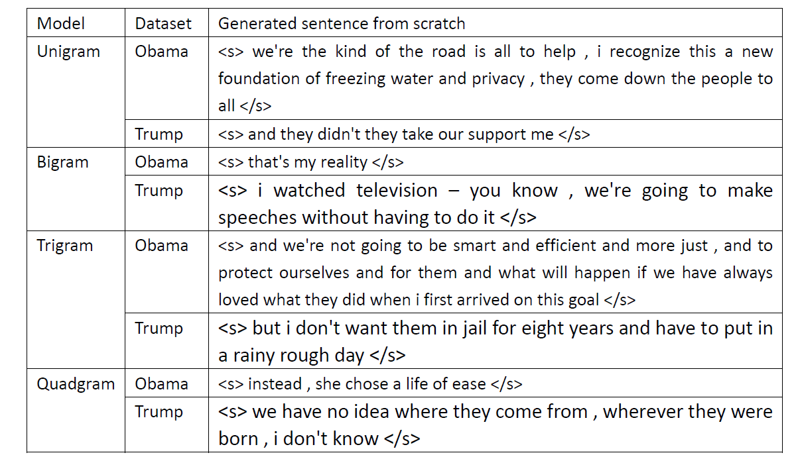

# Miniprojects

Four NLP projects in the cornell course CS4740.

* [Project 1: Classification of Obama and Trump Speech data using Language models]

* [Project 2: Named Entity Recognition with HMMs and MEMMs]

* [Project 3: Simply Neural Models in NLP performing on some Toy Tasks ]

* [Project 4: Squad 2.0 Dataset: Machine Reading Comprehension]

# Project1: Classification of Obama and Trump Speech data using Language models

In this projects, serval n-gram language models using both Obama and Trump datasets are tested.
n-gram models are smoothed using add-k smoothing. Classification Language models are evaluated with Perplexity.

## Random sentence generation with unsmoothed ngram
   Each generated sentence start with a "<S>" token and end with "</S>" token.
   
   For the evaluations, there are basically two tasks: 
   1. Seeded sentence generation where the several words in the start of sentences are predefined 
   2. Unseeded sentence generation where no words are given, sentences are generated from scratch. 
   Examples of unseeded generation for 4 ngram models are given below:
    

<b>Unseeded sentence generate on language models</b> 

   
   Note that The generated sentences for unigram model does not have coherence and some of the sentences are not even complete; the bigram model becomes better that it contains correct word combinations and is somewhat coherent. It is observed that bigram is current for generated sentences that are short in length. Trigram and guadgram generated sentences in most the cases are complete, coherent and understandable 

## Preprocessing
* To deal with unknow words: 
   1. Convert in the training set any word that is not in vocab set as unknown words and map a token of “UNK” 
   2. Do the same thing for the imported text corpus, replace the unknown word by “UNK” 
   3. Update the probability dictionary for the unigram model, adding an “UNK” key 
   4. Map the unknown word probability based on the count of “UNK” in the training file 

* To deal with unseen bigram: 
   1. Recollect the bigram tokens and update the dictionary for bigram, after mapping the ‘UNK’ key 
   2. The probability of unseen bigram is calculated by add-1 smoothing with the formula below: 
      Prob(unseen_biagram(a,b))=1/(count(a)+Vocab_size), count(a) is the number of count of bigrams that starts with token a, 
   
   Note for the step 2, we didn’t explicitly create a dictionary for every unseen bigram, because they are essentially same for all the unseen bigrams if they start with same word token, we calculate it on the fly and use it while we meet a specific unseen bigram during testing. The dictionary we created is only recording the probability of seen bigrams. 

## Result

To verify the method of calculating perplexity shown in the last section. We trained the language model and tested the speech classification accuracy over the dev set. The speech classification task is to classify a part of speech sequences as Obama’s speech or Trump’s speech. 
Add-1 smoothing 
The unigram model and bigram models are implemented with add-1 smoothing. The validation accuracy over the development set is shown in table 4. The dev set contains 100 sample of trumps speech and 100 samples of Obama speech. In this validation experiment, only the bigram models are considered. 

|Models 	|Obama dev set |	Trump dev set |	overall accuracy| 
|:--------------:|:-----------:|:-----------:|:-------------:|
|Unigram model |	0.965 |	0.92 |	0.935| 
Bigram model 	|0.98 	|0.95 |	0.965 |
Validation accuracy for unigram and bigram models</b>

The validation accuracy in the dev set for different Ks is shown the table below 

|K 	|accuracy of Obama dev set| 	accuracy of Trump dev set| 	overall accuracy| 
|:--------------:|:-----------:|:-----------:|:-------------:|
|1 	|0.98| 	0.95| 	0.965| 
|2 	|0.97| 	0.93| 	0.94|
|3 	|0.93| 	0.92| 	0.925| 
|4 	|0.86| 	0.92| 	0.89| 
|5 	|0.73| 	0.91| 	0.82| 
<b>Validation accuracy for different k in Laplacian smoothing over the dev set</b>

As the k increases, the accuracy keeps decreasing. Thus, the best k is set as 1. For curiosity, 
we picked k as numbers smaller than 1 when calculating the probability and surprisingly get better result.

|K 	|accuracy of Obama dev set| 	accuracy of Trump dev set| 	overall accuracy| 
|:--------------:|:-----------:|:-----------:|:-------------:|
|0.1| 	1 |	0.95 |	0.975| 
|0.2 |	1 |	0.94 |	0.97| 
|0.5| 	0.99| 	0.94| 	0.965| 

  <b>Validation accuracy for decimal numbers of k in Laplacian smoothing over the dev set</b> 

Improved accuracies using decimal numbers of k (<1) suggests that the unseen bigram probability should be lower than the probability achieved by add-1 smoothing. A decimal number of K will result in higher probability of seen bigram and lower probability of unseen bigram. It reflects that some of the unseen bigram combination is highly unlikely and should not be smoothed to have 1 count same as others. Therefore, considering add-k smoothing, even if k=1 is best of choice yet is still limited in this regard. This finding also encouraged us to use a more advanced smoothing method.

# Project 2. NER with HMM_MEMM
Common Terminologies Used: NER: Named Entity Recognition, PRF: Precision, Recall, F-scores,HMM: Hidden Markov Model, MEMM: Maximum, Entropy Markov Model, LGR: Logistic Regression, POS: Part of Speech

## Baseline

* Most frequent class classifier:
The assumption to choose this model is that different NER tags for words are not equally likely. Many words are only associated with one tag and most words inside a sentence are not name entities. This indicates that a model based on frequency will have acceptable performance although it can not encode the sequence
* Logistic regression classifier:
Name entities tend to have similar properties (e.g., capitalized, pos tags). In order to integrate these features in our sequential model, a logistic regression classifier is trained. Since the features
used in training the classifier are all extracted from the text, we think it is reasonable to use this classifier itself as a baseline model.

## Sequence tagging model
* HMM
Hidden Markov Model is used for named entity BIO tagging as a sequence model. It is probabilistic model that computes a probability distribution over a sequence of labels and selects the best label. The implementation of the algorithm is achieved with the bigram Viterbi algorithm.
* MEMM
HMM cannot incorporate more context or long distance features. It is essentially a logistic regression classifier, merely by designing a list of customized features, it is able to do well on tagging task. It models the distribution of predicted label (tag in this case) given the data (features).
The involved features including:
  1. <b>Is Capitalized.</b> Most of the named entities are proper nouns like name of person, organization, location which is usually capitalized Eg. America, Barack, W.H.O.
  2. <b>Is Start Of Sentence.</b> Previous feature looks if word is capitalized but we want to keep track of its position as well. Because, start of sentence is also capitalized. Ex. The game
  3. <b>Is Number.</b> Numbers are also named entity which will be part of MISC category in our case
  4. <b>has Hyphen Some. </b>
  5. <b>Is Noun (POS Tag).</b> We want to know is the part of speech associated with the word is noun as it is more likely to be named entity then compared to other part of speech
  6. <b>Is Proper Noun (POS Tag).</b> We want to know is the part of speech associated with the word is noun as it is more likely to be named entity then compared to other part of speech
  7. <b>Follows a Determiner.</b> Nouns usually follow Determiner. Ex. The United States of America
  8. <b>Follows an Adjective.</b> Nouns are mostly seen in sequences like Determiner-Adjective-Noun
  9. <b>Most likely NER Tag.</b>
  10. <b>Previous NER Tag as per prediction.</b>
  11. <b>Previous of Previous NER Tag.</b>
  12. <b>Normalized Word Embedding of Current Word (size: 300) [Continuous Feature]</b>
  13. <b>Normalized Word Embedding of Previous Word (size: 300) [Continuous Feature]</b>
  14. <b>Normalized Word Embedding of Next Word (size: 300) [Continuous Feature]</b>

## Result

|Experiments |Precision |Recall| F1| 
|:--------------:|:-----------:|:-----------:|:-------------:|
|Baseline Model - Most Frequent Class |0.716| 0.744| 0.690|
|Baseline Model -Logistic Regression| 0.594 |0.780 |0.675|
|HMM  |0.710| 0.744| 0.727|
|MEMM |0.866| 0.822| 0.953|
<b>Model Performance</b> 

|Model / Category |ORG |MISC |PER |LOC|
|:--------------:|:-----------:|:-----------:|:-------------:|:-------------:|
|HMM |0.68| 0.64| 0.64 |0.84|
|MEMM |0.70 |0.73 |0.79 |0.82|
<b>MM and MEMM prediction</b>

According to the table, we can see that, when we use very few features, HMM outperforms MEMM.However, the performance of MEMM improves as more and more features are added to the model. This makes
sense because the advantage for MEMM over HMM is that it can use arbitrary features and encode as many features as possible. When there is only very little extra information about the context, MEMM loses its advantage. But when there are a lot of relevant features, MEMM eventually performs well because it has much more context information than HMM. As to the run time, HMM is faster. Features with higher weight are more important for prediction. For MEMM Hand Tuned features, We observed that continuous features for part of speech had huge impact on our development accuracy which is valid as nouns are
potential candidate for NER Tag. Also, word embeddings had very less weight assigned to its features indicating that using them only marginally improves accuracy. We observed a drop in test accuracy over validation accuracy as we have included too many features and may have overfit the model.

## Run time

Average Run Times for HMM and MEMM observed are 18.59s and 230.8s correspondingly.

# Project 3. Sequence_model_attention
## Debugging 
Given a script, find four bugs in the script relating to model file in Pytorch. 
The details of bugs are in the reports file : NLP_project3.doc
## Seq2Seq
3 toy tasks are experimented for sequence model
* Reverse Sequence
* Copy Sequence
* Sort Sequence
Sequence input are strings of numbers.

Two attention machinism are implemented in this project including (1) Additive attention and (2) Multiplicative attention. The difference between these two attention can refer to: [Attention](http://ruder.io/deep-learning-nlp-best-practices/).

## Result
Runtime (n is the sequence length)

|Approach	|Copy|	Reverse|	Sort|
|:--------------:|:-----------:|:-----------:|:-------------:|
|Neural Models	|O(n)|	O(n)	|O(n)|
|Classical Algorithms|	O(n)	|O(n) |Mergesort O(nlog(n))|

|Task	|With Teacher Forcing	|Without Teacher Forcing|
|:--------------:|:-----------:|:-----------:|
|Copy	|0.8275	|0.5216|
|Reverse|	0.9338|0.9457|
|Sort	|0.4227|	0.4431|
<b>Test Accuracy for models without attention on given test set with and without teacher forcing</b>

|Task	|Without attention	|With Additive Attention|With Multiplicative Attention|
|:--------------:|:-----------:|:-----------:|:-----------:|
|Copy	|0.8273	|0.9915 |1.0|
|Reverse|	0.9337	|0.9373 |0.9373|
|Sort	|0.4227	|0.434	|0.4484|
<b>Test Accuracy results for models with and without attention on given test set </b>

●	When we extended the sequence length from 10 to 20, the text accuracy drops from 1 to 0.75. It is proved that the sequence model does not perform well on long sequence. For a relative large vocabulary and a longer input sequence to model, it is seen that the attention performs a lot better than without. It is because it can encode more ‘focused’ dependency on the far away input vectors to learn and represent their relationship in the learning phase. We can see similar behavior in Experiment 2 and 3 due to same reason.
●	The multiplicative attention outperforms the additive attention. It has been studied that the additive is better theoretically for high dimension inputs like word embedding. One of reasons to observe a worse performance of additive attention might be that we only trained 5 epochs for the model. Since there are 3 weight matrices to optimize, the training time to the optimum solution will take longer time.

## Asymptotic Performance
●	For the sequence models without attention, the cost is relatively cheap. The encoder is linearly dependent on the input length therefore is O(n). The decoder produces the same length of output thus the time for decoding is also O(n). Other cost like generating embedding, softmax cross entropy, could be considered as constant time operation. The overall big O without attention is O(n).
●	When we add attention, encoding of input sequences remain O(n), the run time differs in the decoding phase. Now, we need a context vector in each time step. The context vector is computed by running n times of computing attention weights for each encoding states. The followed softmax normalization step and summation of n vectors could be considered as constant run time. Therefore, the complexity of decoding phase becomes O(n2) and the total running time becomes O(n)+O(n2) which is same as O(n2).
●	For additive attention and multiplicative attention, they both have the same asymptotic run time which is O(n2). Yet, their practical run times differ. The multiplicative attention is faster and more space efficient since it only has simple matrix multiplication and one weight matrix to optimize. In the other hand, additive attention involves multiplication and addition and needs to store 3 parameters, making it slower and less space efficient.

# Project 4. QA in Squad2.0
Apply NLP knowledge to implement a MRC system that will work on a real world challenge task: the Stanford Question Answering Dataset (SQuAD) v2. Only part of the full MRC task. In particular, input to the system is a passage with a couple of questions. For each question, the training data
contains either an Answer or a Plausible Answer. The latter is provided for questions that are not answerable given the accompanying text passage. The full MRC task requires providing the answer for answerable questions and identifying the remainder as unanswerable. For this assignment, we will only be attempting the second task: for each question, the output of your system should be a binary value indicating whether the question is answerable (a value of 1) or not answerable (a value of 0). No human intervention is allowed in deriving answers. Below is an example (from the training data):

5 models are implemented in this project.

In order to run all the models, you need to run Preprocess.ipynb first.

* Model 1:InferSent with Semantic Similarity. 
Description: We used pre-trained InferSent to get vector
representation and used cosine similarity metric (written by us) with threshold to predict label
* Model 2:InferSent with our own Syntactic Similarity score along with Semantic Similarity score and logistic regression. 
Description: We used pre-trained InferSent to get vector representation and used cosine similarity (written by
us) as a semantic similarity score. The preprocessed sentences and questions (as strings) are used to compute syntactic similarity score ( written by us) as discussed in experimentation.
* Model 3:Bidirectional LSTM Encoders with Neural Net.
Description: Instead of using pre-trained models to generate vector representation of sentences, we used Bidirectional LSTM Encoders and passed the vector representation into neural network for classification task.
* Model 4: Logistic Regression and Random Forest on feature based approach using similarity scores, POS and other metrics.
Description : We first turned the training data sentences and questions) into Glove Embeddings
with 300D and extract features below based on the sentence-question pairwise embeddings. Then we
trained a Logistic Regression model and Random Forest model using this features.
Final feature vector:
  ● TF-IDF features
  ● POS tag based similarity score
  ● BLEU-score
  ● Average word similarity (measure word
  overlap)
  ● Average wording embedding similarity
  ● average paragraph embedding
  ● TF-IDF weighted paragraph embedding
  ● average question embedding
  ● TF-IDF weighted question embedding

* Model 5:Using Bidirectional GRUs with Additive Attention
Description: In this approach, we used bidirectional GRUs as encoders to extract the vector representation of context and question and further added GRUs, additive attention and dense layers for the classification task. As we wanted to use mini-batch training , we also constrained the context to 600 words and question to 30 words by using padded sequences.

<b>Architecture of MODEL 5 </b>

## Result:

|Model |Accuracy |Precision |Recall |F1 score|
|:-------:|:-----------:|:-----------:|:-----------:|:-----------:|
|1 |0.523 |0.623| 0.5131| 0.5627 |
|2| 0.540 |0.567 |0.557| 0.565 |
|3| 0.552 |0.582| 0.548 |0.564 |
|4|0.612 |0.605 |0.614| 0.609|
|5|0.636 |0.667 |0.682 |0.652 |
<b>Quantitative Results and Analysis for all models </b>

* Baseline model zip file includes:
1.Model 1 is InferSent with Semantic Similarity. You can run MODEL2.ipynb for model 1.
2.Model 2 is InferSent with our own Syntactic Similarity score along with Semantic Similarity score and logistic regression. You can run MODEL2.ipynb for model 2.
3.Model 3 is Bidirectional LSTM Encoders with Neural Net. You can run MODEL3.ipynb for model 3.

* Final zip file includes:
4.Model 4 is Logistic Regression and Random Forest on feature based approach using similarity scores, POS and other metrics. You can run MODEL4.ipynb for model 4.
5.Model 5 is Using Bidirectional GRUs with Attention. You can run MODEL5.ipynb for model 5. rnnlayer.py is attention function we have referred from a github link: [link](https://github.com/wentaozhu/recurrent-attention-for-QA-SQUAD-based-on-keras).

Also, to slove the full task: identify the exact answer span of question, a attention model called BiDAF is typically used. The implementation of this model in Pytorch can refer to the gitub link: [link](https://github.com/kelayamatoz/BiDAF-PyTorch/)
